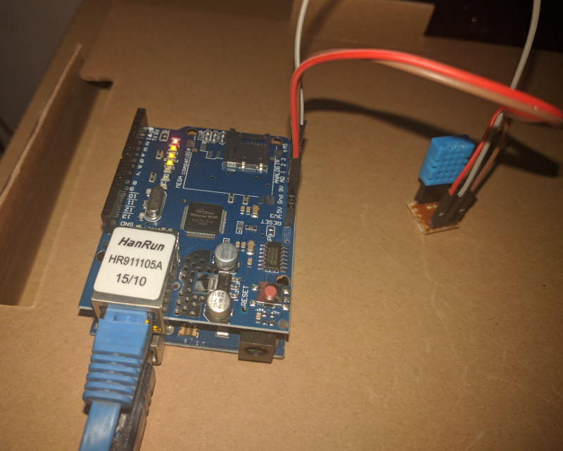
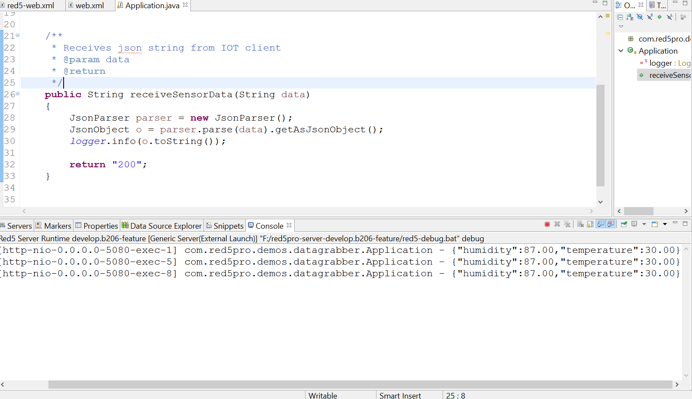

## INTRODUCTION

In this new era of smart web, IOT applications and are finding a special place in the heart of the IT industry world wide. Multiple platforms such as `Arduino`, `Raspberry Pi` etc have come up are blooming in the scope of IOT application development.

Hardware devices are becoming more and more context aware with the use of cheap and efficient sensors. The only true challenge of IOT projects is data gathering, management and utilization which makes the context worthwile and promising. Thats where Red5 pro comes in!! 

Unlike many other use case servers `Red5pro` is a versatile application server which depicts polymorphism in its role as a solution for projects. `Red5pro` can be seens as a simple `java http server`, a `websocket` server, a live streaming `media server` or even a complex all in one data processing hub, which in-turn automatically introduces red5pro as versatile candidate for IOT projects. 


## EXAMPLE USE CASE : SIMPLE DATA GATHERING FROM SENSORS USING RED5PRO SERVER API
---



In this section we shall see how to gather temperature and humidity data from a `DHT11` sensor through `arduino uno` and get it into Red5pro quickly and with minimal effort.

====

#### PREREQUISITE - Red5pro server api

[`Red5pro server api`](#https://www.red5pro.com/docs/server/serverapi/) is a recently launched  component within the composite `Red5pro` architecture, which allows you to interact with Red5pro and its applications at various levels using a simple REST api interface. You cn get more info on Red5pro server api [here](#https://www.red5pro.com/docs/server/serverapi/): 

>> NOTE: Make sure that the security settings on the api component are properly configured to allow your IOT client's IP address and also note down the `accessToken` configured in the `api` component for use in your IOT client calls.

For this use case we will be concerning ourselves with a special `api` called `invoke`. As the name suggests you can use the `invoke` call to call any custom method in your main Red5 application class (ApplicationAdapter) without needing to code anything. All you need to do is create a `public` method in your Red5 application class (ApplicationAdapter) which you wish to call (The IOT client data receiever / handler). Given below is the Application class of our sample Red5pro application called `data-grabber`. You can grab the sample application code from GITHUB [here](#TODO).


#### Red5 Application Class: (IOT server side)
====

```
package com.red5pro.demos.datagrabber;

import org.red5.logging.Red5LoggerFactory;
import org.red5.server.adapter.MultiThreadedApplicationAdapter;
import org.red5.server.api.scope.IScope;
import org.slf4j.Logger;

import com.google.gson.Gson;
import com.google.gson.JsonObject;
import com.google.gson.JsonParser;
import com.google.gson.internal.LinkedTreeMap;

public class Application extends MultiThreadedApplicationAdapter 
{
	private static Logger logger = Red5LoggerFactory.getLogger(Application.class, "data-grabber");
	
	/**
	 * Receives json string from IOT client 
	 * @param data
	 * @return
	 */
	public String receiveSensorData(String data)
	{
		JsonParser parser = new JsonParser();
		JsonObject o = parser.parse(data).getAsJsonObject();		
		logger.info(o.toString());
		
		return "200";
	}
}
```

**EXPLANATION:**

Our custom `IOT` client data handler method is called `receiveSensorData` which expects a json string as a parameter. The invoke  `api` call currently supports only Integer, Double, String and Array, and it must return a data value in order to be invoked successfully. The `IOT`client makes a `invoke' REST api call to Red5pro with the method name to trigger and the parameter array to pass. ([Read more about the invoke api](#https://www.red5pro.com/docs/server/serverapi/#invoke))

The api call is routed to your application class (ApplicationAdapter), where it scans for the requested method. If the method is found and parameters are compatible then the passed parameters are injected intto that method. From there on you can choose what you wish to do with the data - (store in database / relay over websocket / plot a chart).



>>FOOD FOR THOUGHT : 
You could even use the `invoke` api to create a getter method which other IOT clients can use to read from your Red5 application!!


Next we can see the sample IOT arduino client which reads temperature and humidy data via  [DHT11](#https://www.adafruit.com/product/386). This sample arduino sketch can be downloaded from GITHUB [here](#https://github.com/rajdeeprath/Arduino-Sketches/tree/master/red5pro_sensor_client).


#### Arduino code (IOT client side)
====


```
#include <dht.h>
#include <SPI.h>
#include <Ethernet.h>

#define dht_apin A0 // Analog Pin DHT11 sensor is connected to


// assign a MAC address for the ethernet controller.
// fill in your address here: 
// de:ad:be:ef:fe:ed
byte mac[] = {
  0xDE, 0xAD, 0xBE, 0xEF, 0xFE, 0xED
}; // DUMMY MAC ID

IPAddress ip(192, 168, 1, 115); // local ip
IPAddress myDns(4, 2, 2, 2); // DNS
EthernetClient client;

char server[] = "192.168.1.100"; // RED5PRO IP
int port = 5080; // RED5PRO PORT

dht DHT;

String humidity;
String temp;
String data;
String uri = "/api/v1/applications/data-grabber/invoke?accessToken=";
String accessToken = "xyz123";

void setup() 
{
  Serial.begin(9600);
  while (!Serial) {
    ; // wait for serial port to connect. Needed for native USB port only
  }   
  delay(2000); // give the ethernet module time to boot up:
  
  Ethernet.begin(mac, ip, myDns);
  Serial.print("My IP address: ");
  Serial.println(Ethernet.localIP());

  // prepare endpoint uri
  uri = uri + accessToken;
  Serial.print("Connection endpoint: ");
  Serial.print(uri);
  Serial.println();

  delay(2000);//Wait before accessing Sensor
  Serial.println("DHT11 Humidity & temperature Sensor to Red5pro\n\n");  
}


void loop() 
{
    DHT.read11(dht_apin);

    humidity = String(DHT.humidity);
    temp = String(DHT.temperature);    
    data = "";
    data = data + "{\"method\": \"receiveSensorData\",\"parameters\": [\"{\\\"humidity\\\": " + humidity + ",\\\"temperature\\\": " + temp + "}\"]}";

   Serial.println(data);
   doPost(data);

   Serial.println("sleeping");
   delay(10000);//Wait 10 seconds before accessing sensor again.
}


void doPost(String data)
{
   client.stop();

    if (client.connect(server, port)) 
    {
      Serial.println("connecting...");
      
      // send the HTTP POST request:
      client.println("POST " + uri + " HTTP/1.1");
      client.println("Host: 192.168.1.100");
      client.println("User-Agent: Arduino/1.0");
      client.println("Content-Type: application/json;");
      client.println("Connection: close");
      client.print("Content-Length: ");
      client.println(data.length());
      client.println();
      client.println(data);
    } 
    else 
    {
      Serial.println("connection failed");
    }
}
```

**EXPLANATION:**


Whiel most the sketch is self explainatory, the magic is done by creating the data string to be posted along the `invoke` api call.Since we do not support json directly (yet!), you need to convert your data to a string format and pass it as a parameter.

```
data = "";
data = data + "{\"method\": \"receiveSensorData\",\"parameters\": [\"{\\\"humidity\\\": " + humidity + ",\\\"temperature\\\": " + temp + "}\"]}";
```

The string canbe received in your method and converted to a json object to extract attributes from it by name.


## CONCLUSION:

Red5pro is perfect candidate for creating rich IOT applications and the availability o fthe red5pro server api makes it equally easy to integrate your IOT clients to your server code without creating any HTTP apison your own.

